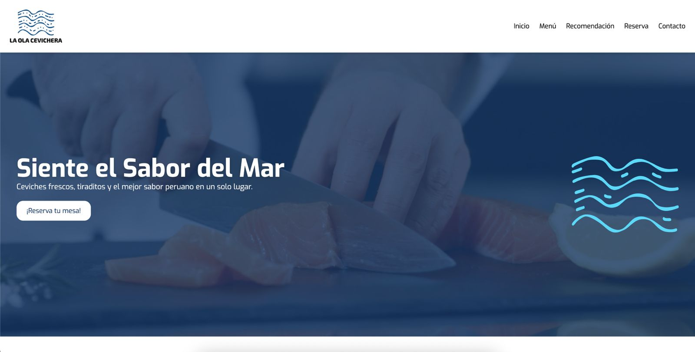
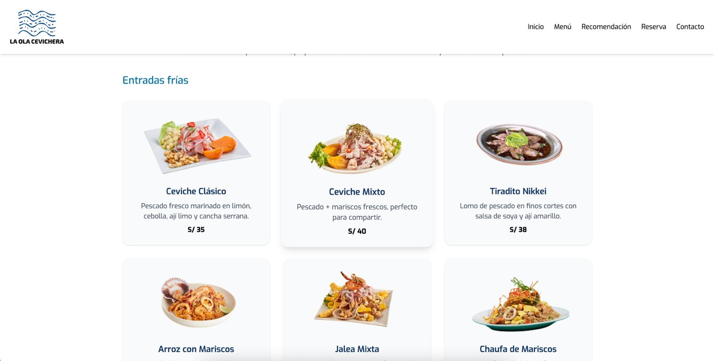

# 🌊 La Ola Cevichera


---

## 📖 Descripción

**La Ola Cevichera** es una web para presentar el menú marino de un restaurante.  
Su objetivo es ofrecer a los usuarios una experiencia rápida, intuitiva y atractiva para explorar los platos estrella y conocer más sobre el restaurante.

Incluye animaciones, diseño responsivo y navegación fluida, ideal para atraer clientes y facilitar la interacción.

---

## 📸 Capturas de Pantalla

| Vista Home                             | Vista Menú                             |
| -------------------------------------- | -------------------------------------- |
|  |  |

---

## 🛠️ Tecnologías usadas

- ⚛️ **React 19 + TypeScript** – Base del proyecto
- ⚡ **Vite 7** – Empaquetador rápido
- 🎨 **TailwindCSS 4** – Estilos modernos y responsivos
- 🎭 **Framer Motion** – Animaciones suaves
- 🎯 **React Scroll** – Scroll animado para secciones
- 🎨 **React Icons** – Iconografía

---

## 🚀 Instrucciones de instalación

1. **Clonar el repositorio**
   ```bash
   git clone https://github.com/tu-usuario/la-ola-cevichera.git
   cd la-ola-cevichera
   ```
# la-ola-cevichera
